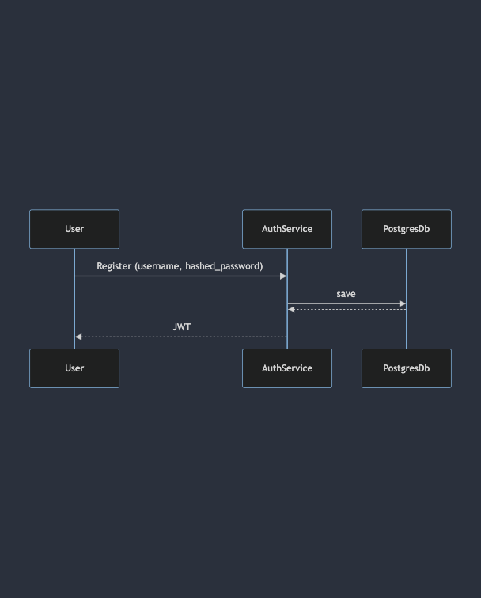
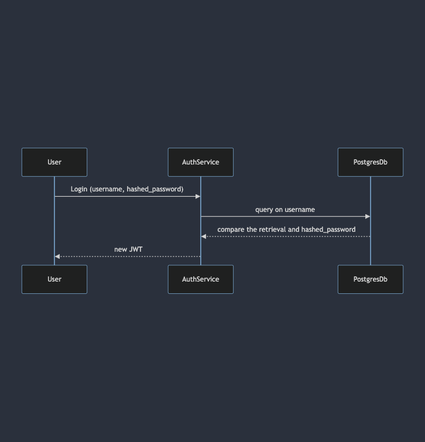

# Summary
This [codebase](https://github.com/SuperNovaRising/VantageScore) simulates a resource (employee) management system, protected by authentication and authorization. Only registered users can read the resources; only the admin can create, update and delete the resources.

This [codebase](https://github.com/SuperNovaRising/VantageScore) is hosted on github and the docker images are hosted in Docker Hub:
[auth-app](https://hub.docker.com/repository/docker/chiungyi/auth-app/general)
[employee-app](https://hub.docker.com/repository/docker/chiungyi/employee-app/general)

## Workflow
Except that admin is provisioned in advance, all other users must register with `auth` service first by providing user name and password. The user name and the hashed password will be save in the `user` database. 

Upon registration, the user will be JWT token. The user must put the JWT at header `Bearer` to access Employee APIs.

The JWT token is set to expire in 15 minutes. The user must obtain the new JWT by `login` into `auth` again.

# Quick start
Please start from booting up [PostgresDb](src/postgres/README.md), [AuthService](src/auth/README.md) then [EmployeeService](src/employee/README.md)

Every component is self-contained; you can boot up docker container or Kubernetes clusters for local development. In addition to README.md, APIs are documented using Open API.

# Review
Ideally, I would write scripts to automate integration test. Due to some difficulties, I only provide steps to manually test the functions

## What are accomplished
- Run and initialize postgres database on local kubernetes cluster
- Run AuthService on uvicorn, Docker container and local kubernetes cluster, publish image to Docker registry
- Run EmployeeService on uvicorn, Docker container and local kubernetes cluster
- When running EmployeeSerice on uvicorn, the whole workflow fully functions. See [Integration Test README.md](integration-test/README.md)

## What are not accomplished
- Not able to publish EmployeeService to Docker cluster
It may have to do with my laptop's limited storage
- When running EmployeeService on Docker and local Kubernetes cluster, the authentication does not fully functioning. It seems the EmployeeService allows all requests

# TODOs
- Move some hard coding or secrets to kubernetes secrets.yaml
- Add integration tests
- Integration with ci/cd
- Write scripts to automate deployment and setup
- Publish my own Docker image or Helm chart to simplify the deployments
