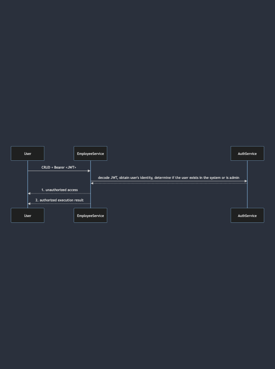

# Summary
This code simulates a resource (employee) management system, protected by authentication and authorization. Only registered users can read the resources; only the admin can create, update and delete the resources.

## Workflow
Except that admin is provisioned in advance, all other users must register with `auth` service first by providing user name and password. The user name and the hashed password will be save in the `user` database. 

Upon registration, the user will be JWT token. The user must put the JWT at header `Bearer` to access Employee APIs.

The JWT token is set to expire in 15 minutes. The user must obtain the new JWT by `login` into `auth` again.

# Quick start
Please start from booting up [PostgresDb](src/postgres/README.md), [AuthService](src/auth/README.md) then [EmployeeService](src/employee/README.md)

Every component is self-contained; you can boot up docker container or Kubernetes clusters for local development

