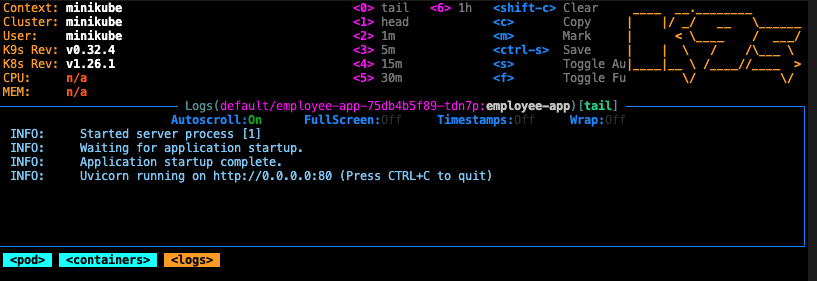
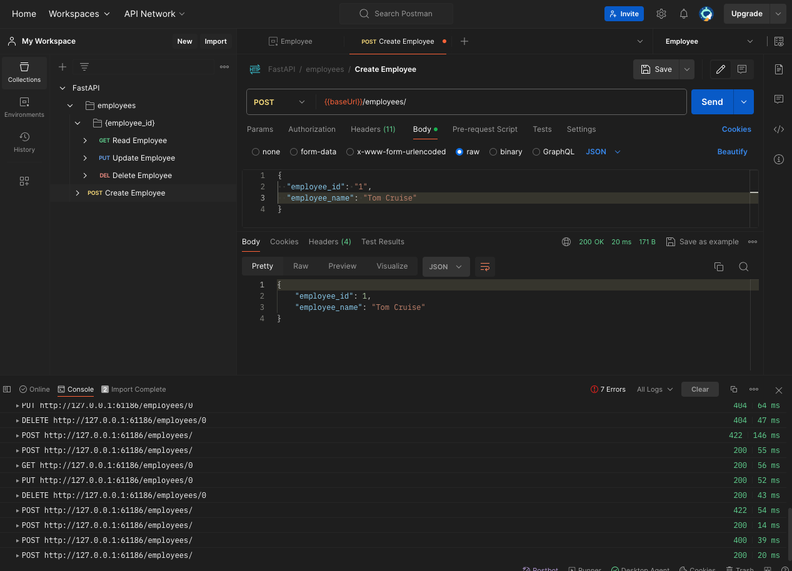

# Summary
This is a self-contained codebase which provides CRUD to manipulate the employee, DOCKER script to build image and Kubernetes configuration to spin up a cluster locally

```
Employee {
    employee_id: int
    employee_name: str
}
```

# Build and test FastAPI Server
In case you need to install dependencies later, use `venv` to isolate the working environment from other parts of your computer
```
python -m venv venv
source venv/bin/activate
pip install -r requirements.txt
```

## Start/Restart FastAPI Server
```
cd src/employee
export PYTHONPATH="<path to project root>/src:$PYTHONPATH"
uvicorn employee:app --reload
```

## API documentation
Refer to Swagger Docs at `http://127.0.0.1:8000/docs`

# Unit Test
## Prerequisite
You may need to install `pytest`, `requests`, `httpx` in advance
## Run unit test
```
cd src/employee
pytest test_employee.py
```

# Build and push Docker image
## Prerequisites
Please install `Docker `, `minikube`, `k9s` in advance

To ensure minikube's Docker configuration be consistent with the Docker configuration used to build the image, run the command to setup minikube's Docker configuration

```
eval $(minikube docker-env)
```

## Build and push Docker image
You may need to log in to the registry and tag the image accordingly before push
```
docker build -t employee-app .
docker push employee-app:latest
```

## Test Docker container locally
```
docker run -d --name employee-app-container -p 80:80 employee-app
```

You can view the Swagger doc at `http://localhost:80/docs`

# Spin up Kubernetes cluster locally
If you have not, please start minikube
```
minikube start
```
## Deploy to Kubernetes
```
kubectl apply -f employee-deployment.yaml
```

## Use k9s to examine the pod and instances
```
k9s
```

Use arrow and enter keys to select interested pod, node and logs

Use Ctrl + C to quit k9s



## Expose the application to port 80
```
kubectl expose deployment employee-app --type=NodePort --port=80
```

## Get URL to access the application
```
minikube service employee-app --url
```

The command will return a url like: `http://127.0.0.1:61186`

As a validation, see Swagger doc at `http://127.0.0.1:61186/docs`


# Test
## Postman
We could leverage Postman for manual test/exploration and automated integration test

You may need to install [Postman desktop agent](https://www.postman.com/downloads/postman-agent/) to access local resources

### Import Open API specification to Postman
Import the json string in [FastAPI.postman_collection](FastAPI.postman_collection.json) to postman. You may need to adjust the environment variable `baseUrl` to `127.0.0.1:61186`

Now you can manually test each API.



### How to generate Postman collection
For completeness, below illustrates how to generate a postman collection

Go to `http://127.0.0.1:61186/openapi.json` to access Open API specification
Create a new collection by import the specification

Crate a new environment, e.g. Employee and set `baseUrl` to `127.0.0.1:61186`

Right click on "FastAPI Collection" and click on Export


## Clean up
Terminate the console running the service
```
kubectl delete deployments employee-app
kubectl delete svc employee-app
```
